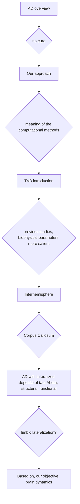

## Markdown of the Notes

**Hyperphosphorylated Tau protein** >> insoluble filaments and big tubular aggregates = *neurofibrillary tangles*;
The brain's clearance system is unable to eliminate the aggregates, then lead to inflammatroy process and neuronal death.

The neuronal death and axonal dysfunction leads to a disconnection of regions in brain networks.

function of tau protein: Maintaining the stability of microtubules in axon.

steps to NFT (neurofibrillary tangles)
1. lose natural function
2. disturbed axonal transportation of vesicles - bad transmission
3. hyperphosphorylated tau protein >> insoluble filaments = NFT
4. neuron death. Connectivity breakdown

## A flow of the AD

## Questions I need to know about the Alzheimer's Disease

1. how to make diagnosis of AD?
	The definitive dignosis of AD requires post-mortem evaluation (Jason Weller et al., 2018)
2. The stages of AD
	Braak and Braak
3. Neurobiology of AD
4. biomarkers of AD

---------------------
### Genetic
Apolipoprotein E (APOE) well-known risk factor gene.

### Some pahognomonic types (special pathological changes)
1. Abeta plaque, extra-neuronal neuritic plaques evident by post-mortem histopathological examination.
2. Neurofibrillary tangles, p-tau is the protein of neurofibrillary tangles and more AD specific protein than total tau. 
3. brain atrophy, by MRI.

